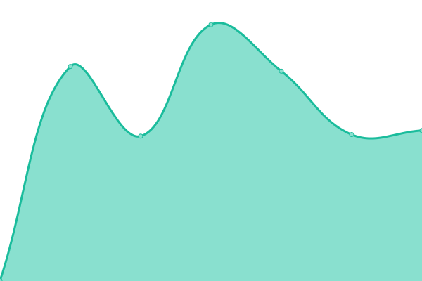
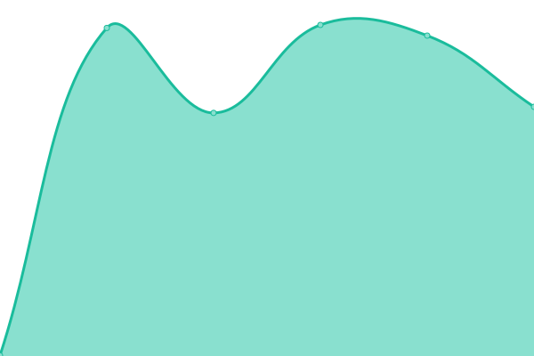

# [📈 Live Status](https://CDU-Neuss.github.io/status): <!--live status--> **🟩 All systems operational**

This repository contains the open-source uptime monitor and status page for [CDU Neuss](https://www.cdu-neuss.de), powered by [Upptime](https://github.com/upptime/upptime).

With [Upptime](https://upptime.js.org), you can get your own unlimited and free uptime monitor and status page, powered entirely by a GitHub repository. We use [Issues](https://github.com/CDU-Neuss/status/issues) as incident reports, [Actions](https://github.com/CDU-Neuss/status/actions) as uptime monitors, and [Pages](https://CDU-Neuss.github.io/status) for the status page.

<!--start: status pages-->
<!-- This summary is generated by Upptime (https://github.com/upptime/upptime) -->
<!-- Do not edit this manually, your changes will be overwritten -->

| URL                                                        | Status | History                                                                                                               | Response Time                                                                                | Uptime                                                                                                                                                                                                                                           |
| ---------------------------------------------------------- | ------ | --------------------------------------------------------------------------------------------------------------------- | -------------------------------------------------------------------------------------------- | ------------------------------------------------------------------------------------------------------------------------------------------------------------------------------------------------------------------------------------------------ |
| [CDU Neuss](https://www.cdu-neuss.de)                      | 🟩 Up  | [cdu-neuss.yml](https://github.com/CDU-Neuss/status/commits/master/history/cdu-neuss.yml)                             |  611ms               |                              |
| [Jan-Philipp Buechler](https://www.buechler-fuer-neuss.de) | 🟩 Up  | [jan-philipp-buechler.yml](https://github.com/CDU-Neuss/status/commits/master/history/jan-philipp-buechler.yml)       |  590ms    |        |
| [Dr. Joerg Geerlings MdL](https://www.geerlings.de)        | 🟩 Up  | [dr-joerg-geerlings-md-l.yml](https://github.com/CDU-Neuss/status/commits/master/history/dr-joerg-geerlings-md-l.yml) |  832ms |  |

<!--end: status pages-->

[**Visit our status website →**](https://CDU-Neuss.github.io/status)

## 📄 License

- Code: [MIT](./LICENSE) © [CDU Neuss](https://www.cdu-neuss.de)
- Data in the `./history` directory: [Open Database License](https://opendatacommons.org/licenses/odbl/1-0/)
